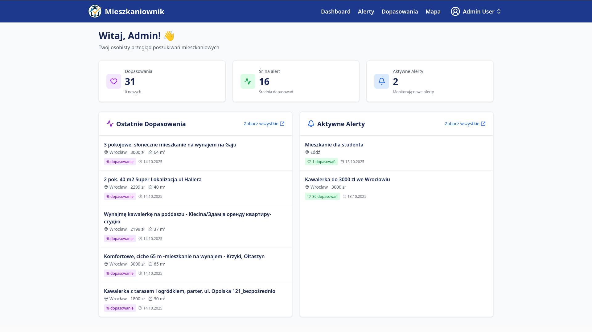
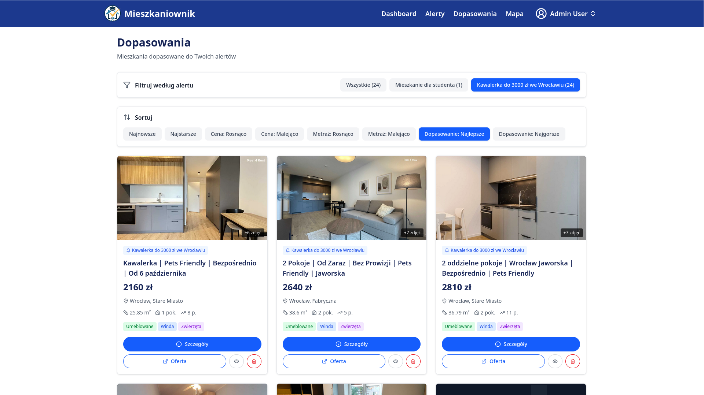
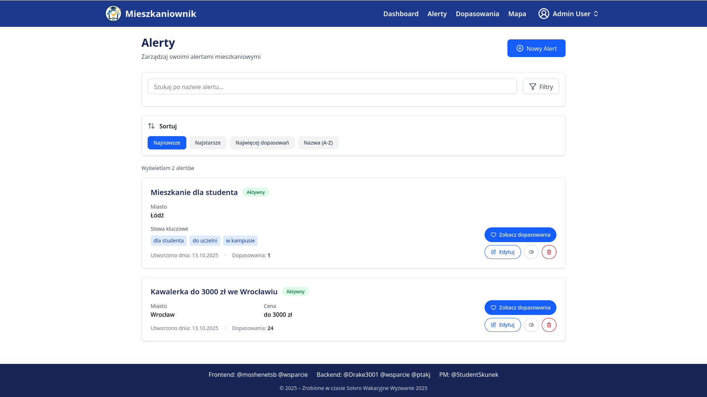
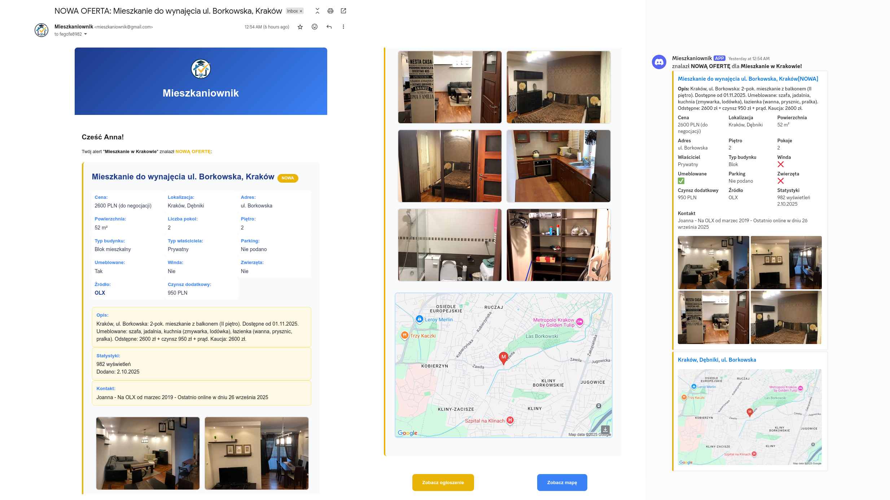
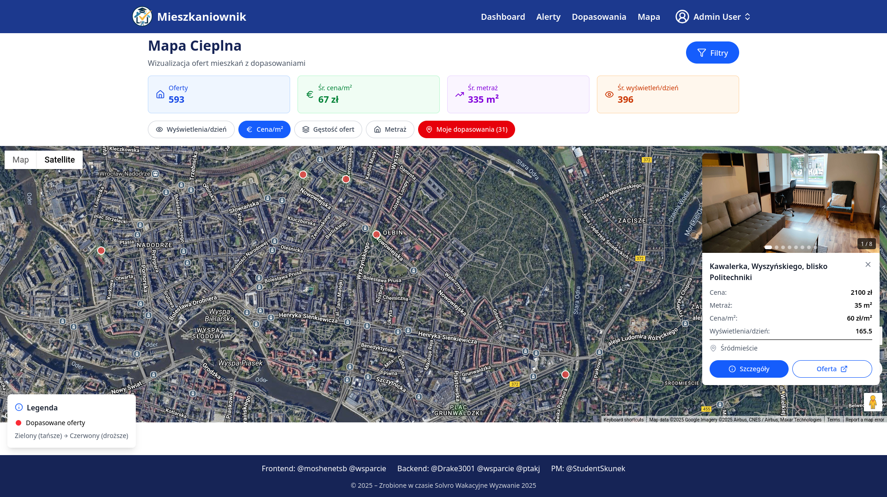
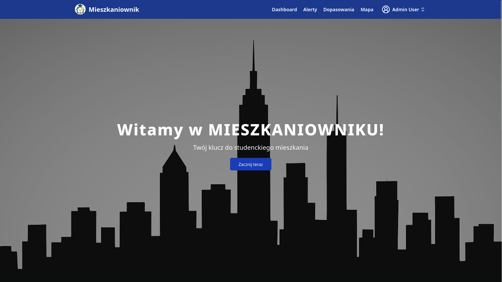

  

    <strong>Your key to student housing</strong>

## Tech Stack

   

    

 

## About the Project

**Mieszkaniownik** is a solution designed for students looking for an apartment or room to rent. With the current turnover of rental offers on platforms like OLX, every second counts. Why spend hours refreshing the website when you can simply create an alert, specify what kind of apartment you're interested in and your budget? Then, as soon as an offer appears, you'll receive a notification via email or Discord with all the most important information.

### Target Audience

Students looking for a room or apartment

### Added Value

- **Time saved** - automatic offer monitoring instead of manual refreshing
- **Faster apartment finding** - instant notifications about new offers
- **More offers to choose from** - aggregation from multiple sources
- **Stress reduction** - no fear or stress associated with apartment hunting

## Application Features

### Dashboard

Monitor your apartment search with personalized statistics and recent matches.

### Matches

Browse matched apartments that fit your alert criteria.

### Alerts

Manage your apartment search alerts with custom filters.

### Notifications

Stay informed with email notifications about new matching offers.

### Heatmap

Explore apartment density across the city with interactive heatmaps.

### Main Page

Welcome screen with quick access to all features.

# Map fix Sun Oct 26 11:29:21 AM CET 2025
